```{r setup, include=FALSE, echo=FALSE, message=FALSE}
knitr::opts_chunk$set(echo = FALSE)
library('knitr')
library('tidyverse')
```


<!-- 
*Total length of literature review should be about 4 single-spaced pages or more (not counting the references page.)*

*Documented in APA style, with section headings for major sections as well as subtopics*
-->

# Introduction

For centuries, oilwells have been drilled vertically and completed by perforation only.  Since the invention of horizontal drilling in the late 20th century, literature has shown that various completion parameters have a significant effect on oil production.  Multiple recent sources agree that there is value in leveraging available data as input to statistical models steeped in machine learning.[@fulks2016optimizing], [@holdaway2015drilling], [@pankaj2018need], [@subrahmanya2014advanced] While there is some disagreement about the limitations and applicability of such models, most agree that a general data analysis workflow is applicable.  [@fulks2016optimizing],[@temizel2015efficient],[@groulx2017multivariate], [@pankaj2018need] 

<!-- 
Using relevant headings, the body should be composed of sections.  
They take up each issue one at a time and discuss how the authors of the articles respond to that issue.  

Don't forget to introduce and close each section with a sentence focused on the literature (topic sentence and concluding sentence.)

Length of body: about 3 pages or more, single-spaced.  (Length of each section will vary, but each typically contains several paragraphs.)
 -->

# Data Quality
One recurring theme within recent literature related to oilwell completion is that of data quality.  @lopes2017mind takes a statistical approach to dealing with gaps in data by breaking synthesizing gaps in otherwise complete data.  @lopes2017mind eventually shows that gaps in data did not have a significant effect on model selection or accuracy.  On the other hand, @wang2016propagation claims that a input uncertainties model selection challenges were primarily caused by missing data and noise.  @khodabakhsh2017cloud took yet another approach via real time models for detecting and classifying errors.  @wang2016propagation suggests Basis Pursuit Denoising (BPDN) as a solution to data quality issues.  Other sources did not comment on dealing with data quality or noise.  

# General Workflow
Regardless of the target variable or underlying dataset, there is wide-spread agreement that data analysis workflows are generally applicable and value-added.  Quoting from @holdaway2015drilling: "Data-driven workflows, models, and analysis can address a diverse array of business problems in the oil and gas industry." @groulx2017multivariate found that their approach applied equally well to all basins(a geologic formation) and plays(oil barring zone) available.  @groulx2017multivariate showed that, generally, the number of performance measures directly correlate with the number of patterns identified.  @groulx2017multivariate indicates that Parallel coordinates approach makes identification of thresholds and correlation windows easy.  Which can be valuable input for other regression efforts.  Furthermore, the predictive proxy approach has a wide variety of applications to completion engineering and management.  [@pankaj2018need] Drilling and lifting in addition to completion also benefit from faster decision making according to @pankaj2018need.  @khodabakhsh2017cloud agrees that the data analytic approach is applicable to the oil drilling industry in addition to oilwell completion practices.  @subrahmanya2014advanced demonstrates that machine learning methods show considerable promise.  @guevara2017datadriven was able to
outperform conventional techniques, such as kriging (a gaussian interpolation method).  Future work in other domains was suggested by a variety of authors: vertical well logs [@guevara2017datadriven], geophysical [@zhang2018mining], fluid dynamics [@ezzatabadipour2017deep], exploration [@Jahromi2017overview], Remote sensing [@Jahromi2017overview], geobotany and geochemistry [@Jahromi2017overview].
There is genuine excitement surrounding the application of machine learning and data analytics to various topics related to oil and gas production.

# Feature Importance
Each author provides some insight into what features are most important for predicting oil production accurately.  As a default position; High proppant (sand or other particulates used to prop open fractures in rock under high pressure), high-fluid (usually water, but sometimes gelling or cross-linking additives are included) completion designs described by @fulks2016optimizing have shown success every basin.  @fulks2016optimizing goes on to say that degradable diversion (poly lactic acid diverts pressure but eventually degrades by bacteria) improves cluster efficiency and optimal lateral landing zone are important.  In contrast, @temizel2015efficient lists in order of importance fracture half-length (which could be related to diversion), proppant amount, zone coverage (nearly equivalent to landing zone), and slurry volume (slurry is the combination of fluid with proppant).  @ezzatabadipour2017deep is more interested in two-phase flow patterns as a function of pipe condition.  @zhang2018mining purports that chemical ingredients are conducive to production and some, in fact, negatively impact gas production.  [@zhang2018mining] @lopes2017mind includes rock and fluid properties.  While @guevara2017datadriven expects to add well completion parameters to their model.  @Jahromi2017overview provides structural geology and reservoir properties (fault lines, water zones, etc.) as important features.  @wang2016propagation focuses on trap and peel heights as well as gas flux, plans to add droplet size and gas-oil ratio to that list.  

# Simulation
Another common thread among recent literature is the idea of simulating new data from predictive models.  @temizel2015efficient sees simulations as a tool to determine not only feature importance and significance, but also effect direction.  @temizel2015efficient goes on to say that simulations can replace commercial fracture simulators.  The approach described in @pankaj2018need creates a "parametric explosion of parameters"; enabling optimal well completion design to be determined much faster than with traditional methods, a matter of minutes instead of months.[@pankaj2018need].@bozoev2016selection agrees that simulation tends to be an appropriate approach to choosing the optimum completion of the wellbore.  Like-wise, @ezzatabadipour2017deep notes that investigations could be improved by exhaustive searches.  @wang2016propagation also observes that resorting to simulated data from very high-resolution numerical simulations is a good compromise.  @liu2018relationship uses simulation to study early hydration stages of a cement slurry which effect the transmission of hydrostatic pressure.

# Model Limitations
Though there is much fanfare surrounding data analytic approaches applied to oilwell completions, many authors note that there are limitations to such endeavors.  @fulks2016optimizing says that establishing baseline performance is necessary.  @temizel2015efficient takes the stance that conclusions from data driven models are specific to the model used.  Careful consideration is necessary for normalizing both performance measures and inputs.  Before discernible conclusions, patterns detected must be reviewed to refine insights.  [@groulx2017multivariate] @pankaj2018need notes on that a calibrated model is fundamental to a reliable prediction.  @bozoev2016selection has concern that analytical approaches do not take into account interference effects.  @wang2016propagation adds that next stage numerical models must be able to handle mixtures of oil and gas in order to simulate realistically.

# Conclusion from Literature
For centuries, oilwells have been drilled vertically with little care about completion.  Today, horizontal drilling has changed that.  literature shows completion parameters have a significant effect on oil production.  And that these parameters can be used to make accurate predictions.  While there is some disagreement about the limitations and applicability of such models, most agree that a general data analysis workflow is applicable.  

# Regression Analysis
<!--  briefly refresh the reader's mind as to the variables of interest -->
Welldatabase is an aggregator of publically available data related to oil and gas production. Many states have an entity responsible for collecting and enforcing reporting requirements which vary between juisdictions. In Texas, for example, Texas Railroad Commission (TXRRC) regulates the oil and gas industry. Location and depth of well casing is tightly regulated. TXRCC requires all hydrocarbon production that leaves the well site to be reported monthly. In the state of Texas, oil wells are tested for once per year. This analysis will focus on two counties in west Texas, Midland County and Pecos County. Our goal is to model 12 month cumulative oil production as a function of publically available drilling and completion parameters summarized in the following table.

<!-- Use at least 4 explanatory variables -->


```{r echo=FALSE}
data.frame(column = c('api'
                      ,'surfacelatitude'
                      ,'surfacelongitude'
                      ,'county'
                      ,'producing_formation'
                      ,'wellboreprofile'
                      ,'trueverticaldepth'
                      ,'laterallength'
                      ,'totalbasewatervolume'
                      ,'totalproppantmass'
                      ,'fluidsystem'
                      ,'surfactantpresent'
                      ,'claycontrolpresent'
                      ,'acidtreatmentpresent'
                      ,'chokesize_clean'
                      ,'oil'
                      )
           ,description = c('14 digit unique well identifier'
                            ,'surface location'
                            ,'surface location'
                            ,'Texas county'
                            ,'geologic formation'
                            ,'type of drilling'
                            ,'depth of production casing'
                            ,'horizontal component of well'
                            ,'volume of water used'
                            ,'mass of sand used'
                            ,'type of fluid additives'
                            ,'wether or not surfactant was used'
                            ,'weather or not clay control was used'
                            ,'weather or not acid was used'
                            ,'open proportion of valve'
                            ,'first 12 month cumulative oil production'
                            )
           ,units = c(''
                      ,'degrees'
                      ,'degrees'
                      ,'either Midland or Pecos'
                      ,'e.g Wolfcamp, Spraberry'
                      ,'Verical, Directional, or Horizontal'
                      ,'feet'
                      ,'feet'
                      ,'gallons'
                      ,'lbs'
                      ,'slick-water, linear, or  cross-link '
                      ,'True or False   '
                      ,'True or False'
                      ,'True or False'
                      ,'0 is closed, 1 is open'
                      ,'bbl '
                      )
           ) %>% kable()
```
         
# Preprocessing
Each table of welldatabase must be summarize and deduplicate by api number then joined to the header on api where wellboreprofile=HORIZONTAL. For this analysis, we are only interested in horizontal wells. It was noted that totalproppantmass has many zeros. This is not physically meaningful, so when totalproppantconcetration=0 we will set it to null instead. The python code for this processing is available on [github](https://www.github.com/wilsonfigy/AppliedRegression/master/). It is tempting to use the reported monthly oil production as is, but that would lead to a target variable that is highly auto-correlated; meaning that the previous month's production is a good estimate of production in the next month. For this reason, we will focus our effort on modeling cumulative oil production. <!-- create a pairs plot on the explanatory and response variables. --> At this point, let's consider the scatter plot matrix. 

\newpage

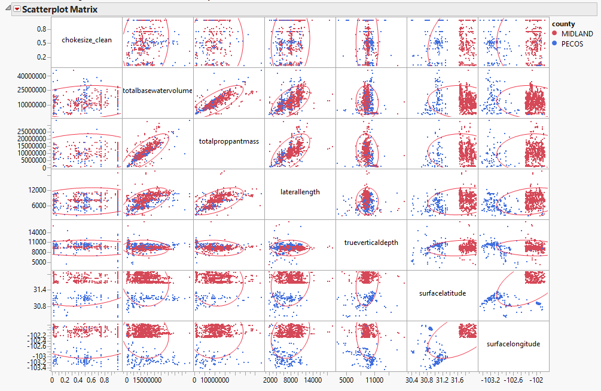

From the scatterplot matrix, we can clearly see locational separation of the two counties in question. We can also see that totalpropantmass, totalbasewatervolume, and laterallength are highly correlated. To combat this, we will consider some new predictors which are scaled by length as well as the proppant concentration (proppant/water).


```{r echo=FALSE}
data.frame(column = c( 'proppant_per_ft'
                      ,'water_per_ft'
                      ,'proppant_concentration'
                      )
           ,description = c( 'totalproppantmass / laterlength'
                            ,'totalbasewatervolume / laterlength'
                            ,'totalproppantmass / totalbasewatervolume'
                            )
           ,units = c( 'lbs/ft'
                      ,'gal/ft'
                      ,'lbs/gal'
                      )
           ) %>% kable()
```

\newpage

```{r}
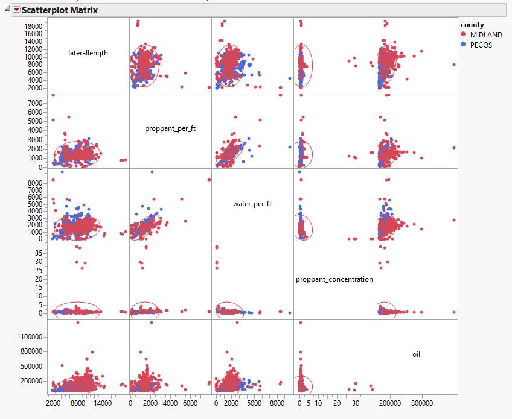
```

The newly calculated columns appear to be less correlated with each other and potentially better linear predictors of oil production.


# Modelling

<!-- Is there any reason to fit a quadratic term? -->
Even though it is expected that the relationship between the predictors and oil production is highly non-linear. Let's consider a naive main-effects-only model.

```{r}
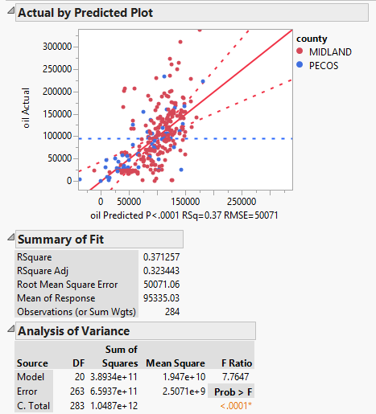
```

From the $R^2$ and $R^2$ adjusted values, this model explains about 30% of the variation in oil production. While not very accurate, this model could still be useful for industrial predictions.

```{r}
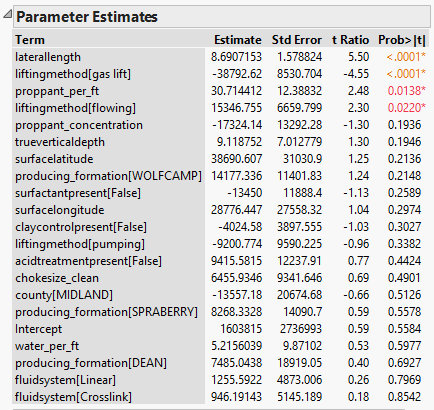
```

Based on an F statistic of < 0.0001 at least one coefficient is significantly different from zero, so we should proceed with attempting to improve this model. Based on t-statistics of each parameter we can see that relatively few coefficients are significantly different from zero. The most significant are laterallength, liftingmethod, and proppant_per_ft. A unit increase in proppant_per_ft is associated with an increase of 30 barrels of oil. Already we have performed about 20 hypothesis tests for significance.

<!-- Fit your model. Include quadratic, log, or interaction terms as you see fit.-->

<!-- Interpret your beta coefficients to the best of your ability. -->

<!-- Are your coefficients significant? -->

<!-- Use the F test to compare two nested models. The smaller model should have at least 2 fewer variables than the larger model. -->

<!-- Report the R2 and Adjusted-R2 values. -->

<!-- Comment on the fit of the model as determined by how much variability is explained. -->

<!-- Is this a guarantee that the model will accurately describe the population? -->

Linear regression assumes homoscedasticity, meaning that the residuals are normally distributed with a mean of zero and constant variance i.e. $\epsilon \sim N(0,\sigma^2)$. From a plot of residual vs predicted oil, we can see a "megaphone" pattern which is evidence that this model violates the assumption of constant variance. In contrast, a similar main-effects only model predicting log(oil) exhibits more constant variance in the residual.


```{r}
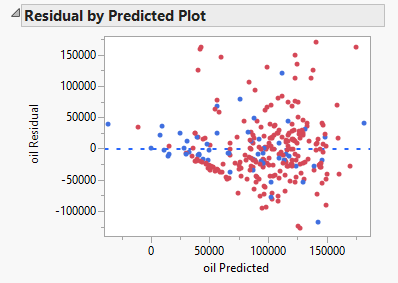
```

```{r}
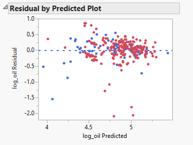
```

Going forward we will consider two models of log(oil). The first is the main effects only model with the least significant terms removed, the second is a polynomial model up to degree two meaning that there will be a term to capture quadratic and interactive behavior. For the second model well will use step-wise regression to add terms until Bayesian information criteria (BIC) cannot be reduced by adding an additional term (forward selection).

```{r}
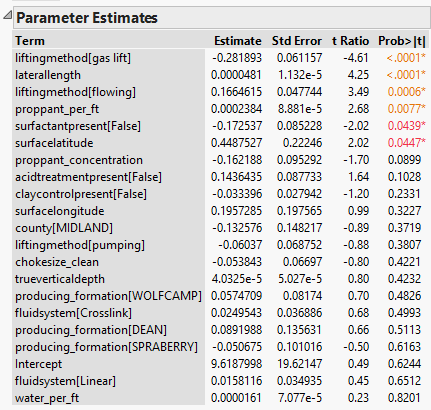
```

Removing water_per_ft, fluidsystem, and producing_formation results in the following reduced features main-effects only model.

# Reduced Main Effects Model


```{r}
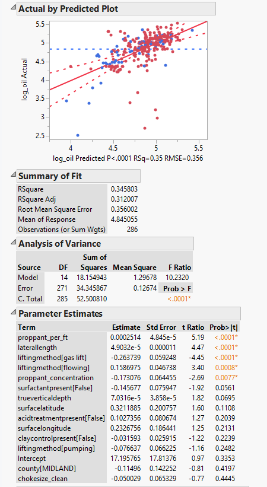
```

```{r}
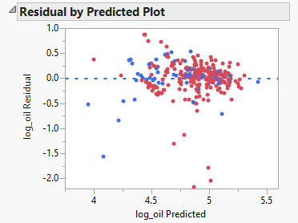
```

This model explains about 30% of the variance in log(oil). Several main effects are still insignificant, but each coefficient is easily interpreted. For example, an increase of 1 lb/gal in proppant concentration is associated with a decrease 0.17 in log(oil) or $ 10^{0.17} = 1.48$ barrels of oil


```{r}
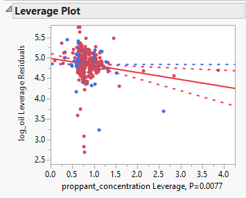
```


```{r}
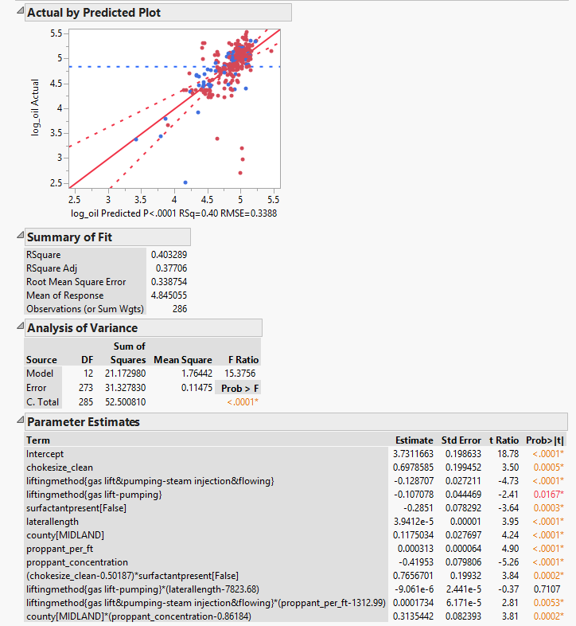
```

```{r}
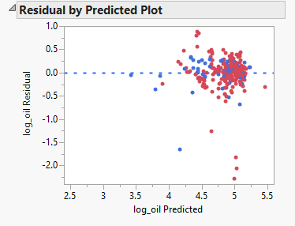
```

This model explains nearly 40% of the variance, a marked improvement. Nearly all coefficient are significant, however some are much more difficult to interpret. In this model a change in proppant would effect more than 4 terms of our model in a non-linear manner. 

```{r}
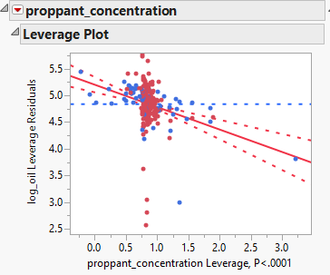
```

<!--
## Residual Analysis

### Use plots to get an idea of which points may be contributing to the fit.
### Consider re-fitting a model with and without certain data that have both high leverage and large residuals.
** Do not include every plot, but consider including plots that give the reader an idea of your analysis. **

## interpretation of the model that makes sense.
### Why do you think some variables stayed significant and others dropped out?
### Are any of your variables highly correlated
### Give CIs for a mean predicted value and a future predicted value for at least one combination of X's (from your final generalized linear model).
-->

# Summary

It is possible to predict the first 12 months of oil production from publicly available drilling and completions information with a useful accuracy. In this analysis we performed a total of 54 hypothesis tests. However, refrained from setting any arbitrary significance level. Instead, we focused on the most and least significant terms as well as balancing predictive power with easy of interpretation. While complex a polynomial model explains more variation, a main-effects only model is equally useful and much easier to interpret. Proppant amount per foot and per gallon was the most significant feature regardless of model selection. 

<!--
### Count the number of total hypothesis tests that you ran (including all the ones you didn't include in the report). Call that number m. If you multiplied every single p-value in this report by that number, would any of your conclusions / analyses have fundamentally changed? Which ones? How?
-->

# References

<!-- 
# Format
* Word or pdf
* Only include code that is interesting to the reader.
* Do not print lists of data.
* If you are commenting on the significance of a variable in your text, you should report the p-value.
* Residuals determine model appropriateness, not p-values or R2.
* Summarize any output from R; do not include technical calculations. 
* Use complete sentences.
* Make sure sections flow nicely into one another. 
* Remember to label all graphs.
-->
